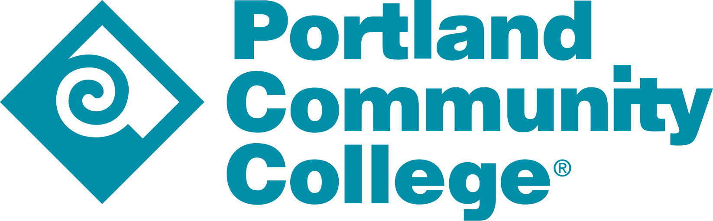

# PCC Hackathon Guide

Thank you for attending this year's Portland Community College Hackathon! If this is your first time attending a hackathon, then welcome! We hope to make the experience a memorable one where you'll learn new things, meet cool people, and most importantly have fun.

If you've attendent one of our hackathons before, welcome back! Skim through the material and see if anything has changed since your last visit. 

## What is a hackathon?

A hackathon is a short‑term, collaborative event where people of a wide range of skills and experiences come together to build something new, usually a software project, in a limited amount of time. Think of it as an intensive, friendly sprint that blends learning, teamwork, and a dash of friendly competition. Everyone’s here to learn, not to judge.

You'll form small teams and choose a problem or idea you're excited about, and then dive into planning, coding, designing, and testing. By the end of the event, your team presents a working prototype or a demo.

The "hack" in hackathon is more akin to "hacking something together" rather than "hacking a computer system" so don't worry if you don't have any cybersecurity experience. By it's nature, you may not have a polished product by the end of our time together and that's okay! If you're excited about what you and your team creates, we encourage you to continue working on it either individually, your team, or other folks that might be interested in it.

# Table of Contents

Below, you'll find links to different parts of this guide. Everything from how to get started to learning how to use a specific device.

* [Hackathon Rules & Schedule](rules_schedule/README.md)
* [Brainstorming ideas](brainstorm/README.md)
* [Tools for Collaboration](collab/README.md)
* [Foundational Linux Skills](linux/README.md)
* [Device Guide](devices/README.md)
	* [mycobot 280](devices/mycobot280/README.md)
	* [myAGV](devices/myAGV/README.md)
	* [DOFBOT-Pi](devices/dofbot-pi/README.md)
* [For Hackathon Organizers](staff/README.md)
	
# References
+ [mycobot 280](https://github.com/elephantrobotics/myCobot)
+ [myAGV](https://github.com/elephantrobotics/myAGV-docs)
+ [DOFBOT-Pi](https://github.com/YahboomTechnology/dofbot-Pi)

# Special Thanks & Recognition
*Quinn Jensen* for helping me get pictures of the devices and screenshots of the software.

# Changelog
| Date | Version | Description|
|-------|-------|-------|
|2025-12-01| v1.0 | First version |