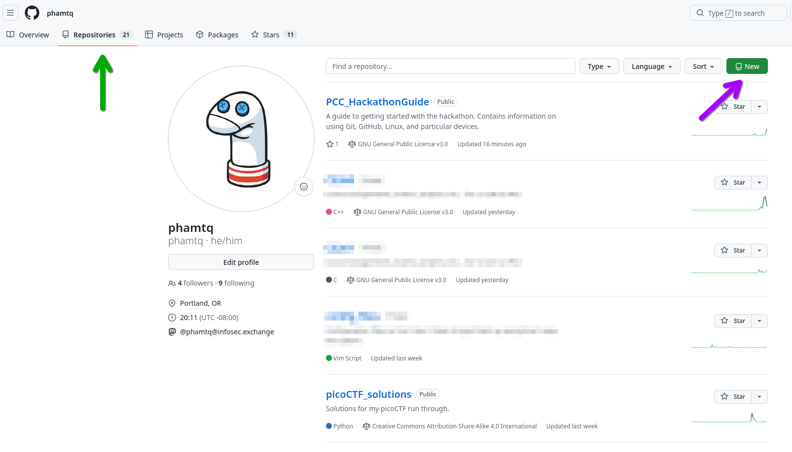
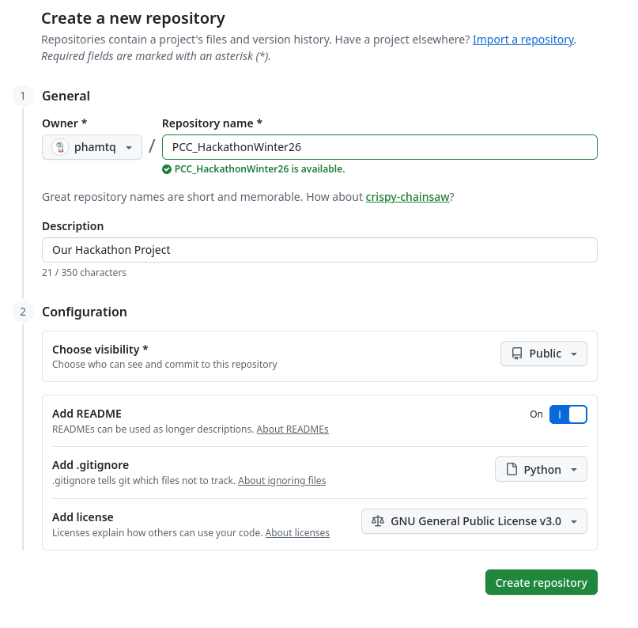
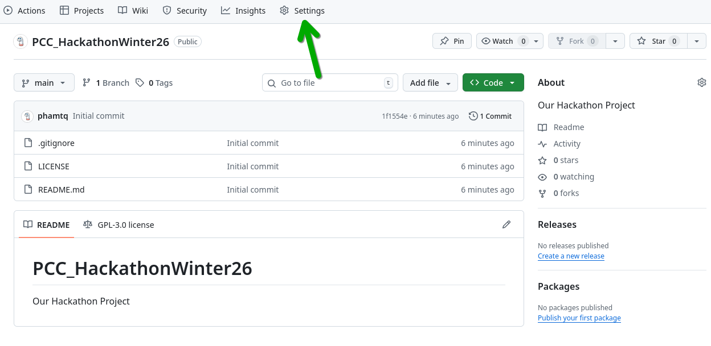
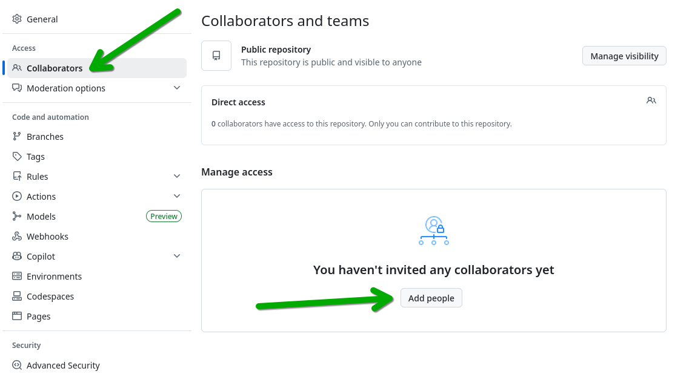
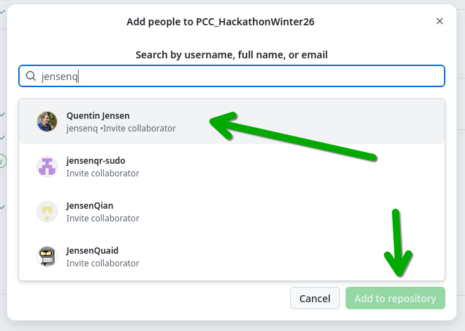
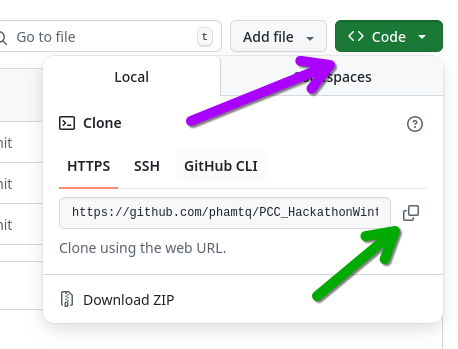

# Tools for Collaboration

Ideas are a dime a dozen. Everyone has them, but not everyone has the ability to bring them to life. And you certainly won't be able to do it on your own. In addition to there not being enough robotic equipment for everyone to work by themselves, you don't have enough time. You're going to feel tired and frustrated and that time you spend recovering can be made more useful by letting other people work on other parts of the project.

So to increase your chances of bringing that project to fruition, you're going to need some tools to organize everything and keep everyone on the same page. Many of these tools are used as part of projects in jobs you'll encounter when you graduate. 

# Table of Contents

+ [Project Management Software](README.md#project-management-software)
+ [Communication Tools](README.md#communication-tools)
+ [Central Repository](README.md#central-repository)
	* [Online Git Repository](README.md#online-git-repository)
	* [Cloning](README.md#cloning)
	* [Git Basics](README.md#git-basics)
	* [Helpful Tips!](README.md#helpful-tips)

## Project Management Software
You can use everything from a simple shared TODO list like [Google Keep](https://keep.google.com), or ones specifically designed for larger projects like:

+ [Trello](https://trello.com/)
+ [Notion](https://www.notion.com/)
+ [Asana](https://asana.com). 

They're all free or have a trial period that will work for your 1 day project. 

If you're unfamilar with any of these tools, I suggest writing the tasks down on paper and then transfering it to these pieces of software as you get more familar with it. 

## Communication Tools
While you're going to be next to each other working on this project, some of you might want to work away from the group in a quiter spot. Having a way to communicate with each other will help you stay in the loop while letting you get things done. It's also a good way to transfer small files to each other like a PDF or web link of something you found.

You can use things like [Discord](https://discord.com/), [Slack](https://slack.com/), or even starting a group chat over iMessage, Android Messages, or What'sApp.

## Central Repository
You're going to want to a way to manage the code you and your teammates are writing. After all, if you and a teammate are working on the same source code file, how do you ensure that both your edits are available when it comes time to run it?

The solution to this issue is called a version control software system. The most popular one these days is the software known as `git`. Created by the same guy that created Linux, it a very handy tool used throughout the industry to work collaboratively on software.

Here's now you get started. First, download the software to your computer. Here the various ways to do that depending on which operating system you're running.

**Windows**

Download the installer for Windows [here](https://git-scm.com/install/windows) and install it. Use the defaults during the installation except for your preferred editor like `vim` or `VS Code`. When that's done you can launch it by double-click on the `Git Bash` icon on your desktop.

To test to make sure it installed correctly, type:

> $ git --version

Skip down to "Git Setup" when finished.

**macOS**

To run it on macOS, you're going to first need to install a program called `homebrew` to make the process much easier. Open the `Terminal` and go to the [official Homebrew website](https://brew.sh/). Follow the instructions on the page. Then run this command in the `Terminal`:

> $ brew install git

To test to make sure it installed correctly, type:

> $ git --version

Skip down to "Git Setup" when finished.

**Linux**

Arguably the easiest method but that'll vary depending on which package manager you have for your particular distro. For example, to install it on Arch Linux:

> $ sudo pacman -S git

For Fedora:

>$ sudo dnf install git

For Ubuntu:

> $ sudo apt install git

To test to make sure it installed correctly, type:

> $ git --version

Skip down to "Git Setup" when finished.

**Git Setup**

One of the first things you're going to want to do is set up your installation with your information. Since it's easier to set it up for all your projects rather than go through this process for each of them, you're going to make the settings "global":

Type these two commands, replacing the name and email with your information:

```sh
$ git config --global user.name "Maria Perez"
$ git config --global user.email maria.perez@pcc.edu
```

### Online Git Repository
You're going to want to host your project online so that your other teammates will have access to it. There are many services that do it such as [GitHub](https://github.com/), [GitLab](https://about.gitlab.com/), [Bitbucket](https://bitbucket.org/), and [SourceForge](https://sourceforge.net/) but for our purposes, we're going to use one of the more popular ones, GitHub.

Have everyone on your team sign up for a GitHub account if they don't already have one by clicking on the `Sign Up` button on the top right corner of the page.

Once that's done, designate one team member as the holder of the project like the Project Manager. Don't worry, you'll all have access to it and make a copy when the event is done. That person will create a new repository (*repo*) for the project. To do that click on the `Repositories` tab and then the green "New" button. 



Next, fill in the settings for your project. Just about everything on here can be changed so don't worry about making any mistakes. A good project name might be `PCC_Hackathon_Winter26`, especially if you plan on doing it every term.



Click the green `Create repository` button when done.

Now we're going to give your teammates access to the repo. Click on the `Settings` tab.



Then click on `Collaborators` on the left hand size menu, and then on `Add people`.



Add your teammates by their GitHub username and click on the green `Add to repository` button when you've added them all. They might need to confirm the addition in the email. 



After that, we're going to create a copy of the project on each of your teammates computers. Click on the green `<> Code` button and then on that icon next to the web address.

Finally, we going to download and run a program made by the folks at GitHub to handle the logins called GitHub CLI. Follow this [guide](https://github.com/cli/cli?tab=readme-ov-file#installation) for your specific operating system. Then run:

> $ gh auth login

and follow the prompts.

### Cloning



Go back to your `Terminal` / `Git Bash` program and go to a folder where you want to keep your project (for example, your Documents folder). Then type `git clone` followed by the web address you copied:

> $ git clone https://github.com/some_user/project_name.git

This will make an exact copy on your computer! If you want to continue working on your project on another computer after the Hackathon, just type the command again.

### Git Basics
Now that everything is set up for the project, let's show you how to use the `git` commands to get stuff done. 

The general rule is that it is better to make frequent "posts" to the repo than one really big one. Why? Because smaller ones are easier to understand what changes were made and far easier to revert back to a previous version without destroying other work. Always ask yourself, "How bad would I feel if my computer crashed right now?" That's a good way to tell if you should "post" to the repo.

The general flow of working with `git` is:

Edit code >> Add Files to the Staging Area >> Commit those changes >> Push changes to the online repo

**To Add Files...**

The program, `git`, automatically tracks any changes you make to your files and allows you to puts it into a place called the "Staging Area". It's here that you can check to make sure the files you want to add to the repo are the right ones. Type this command to add them to the "Staging Area":

> $ git add names_of_file1 names_of_file2 names_of_file3

This adds each individual file you specify. But what if you want to add a ton of files you worked on? Type this:

> $ git add .

**To Get the Status of Files Added...**

To see what files are going to be posted, you can run the `git status` command. Why would you want to do this? There are a lot of reasons.

Let's say you accidently added a file that contains a login and password. You don't want the whole world to have access to it! Or you're not sure if you added a file that you just worked on.

By running `git status` you can see if it's in the "Staging Area". Lines in green mean that it's put into the area while red ones have not. To remove a file that's green (aka been staged) type:

> $ git restore --staged some_file_you_want_to_remove

**Commit changes**

Those "posts" that I mentioned earlier? They're official called "commits" in `git` speak. Commits allows you to post the changes to the project and included messages to anyone reading it about what you did.

Commits can only occur once the files have been added to the "Staging Area". To run a commit, type:

> $ git commit -m "Some descriptive message"

It's generally good practice to have the message reflect the ***one*** thing you did and written in such a way that it sounds like a command (imperative form). Also keep it short and sweet. For example, let's say you added some code to make the robot turn it's arm. You could write:

> $ git commit -m "I added some code to move the robot's arm so that it could do this one really cool things that I saw on a YouTube video..."

But a better way would be to write it this way:

> $ git commit -m "Add code to move robot's arm"

One's too much to read and the other is just enough to know what occurred. If you're interested, here's a [blog post](http://chris.beams.io/posts/git-commit/) about why people do it this way. Basically it makes it so that it matches the style that `git` writes messages and makes it easier to read the log.

**Checking the log**

And speaking of the log, how do you check it? By typing:

>$ git log

This gives you something like this:

```sh
commit 5bf2808420c9927354d2bf2b836be5af228b6ccf (HEAD -> main, origin/main, origin/HEAD)
Author: Timothy Q Pham <tim.pham4@pcc.edu>
Date:   Fri Feb 13 20:45:41 2026 -0800

    Complete Online Git Repository instructions

commit 49d9da00504928e0a552d583ee83d9cfb1e83ffe
Author: Timothy Q Pham <tim.pham4@pcc.edu>
Date:   Fri Feb 13 19:56:39 2026 -0800

    Write text for git installation instructions

commit acf1c70328fad7b700f5da938319b2116b2b6b90
Author: Timothy Q Pham <tim.pham4@pcc.edu>
Date:   Fri Feb 13 13:59:19 2026 -0800

    Update Project Management Software with more programs
```

Each commit has a special "serial number" so that if you want to revert your changes back to that one, you just specify that.

**Push Your Work to GitHub**

Once you've made your commit, you can "push" it to the online repository (in this case GitHub).

> $ git push

You can go on the GitHub website and see that the changes have been recorded!

### Helpful Tips!

Arrange your program in such as way that teammates won't be working on the same file. This makes it easier to commit changes without running into the dredded "merge conflict". Otherwise someone on the team is going to have to manually figure out if the changes to the same file need to be resolved. It can be a big headache sometimes. 