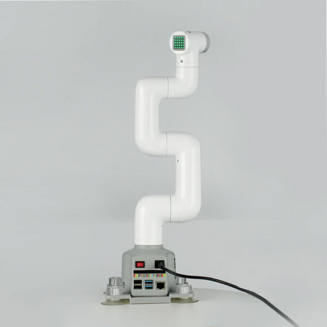
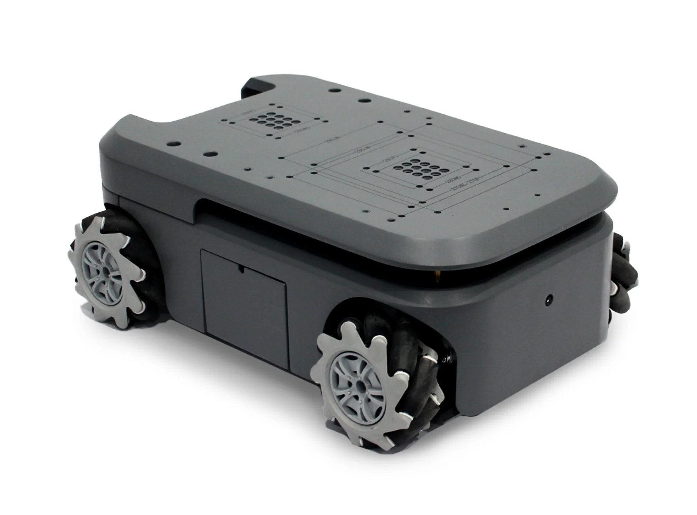
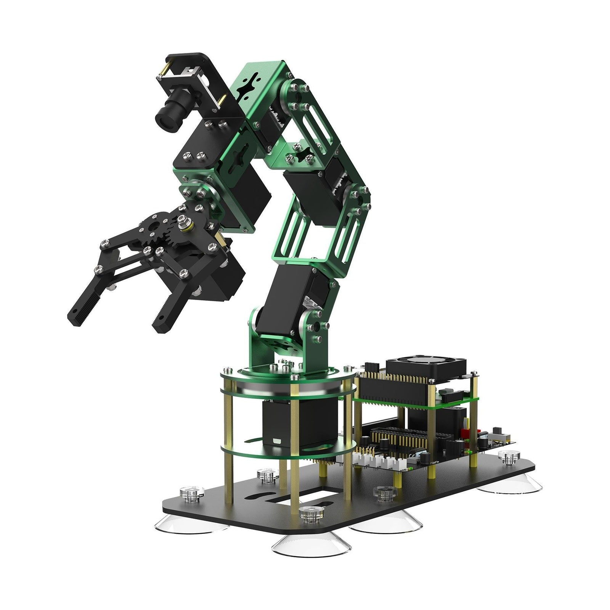

# Device Guide

There are 3 types of robots available to you. Click on the link below to jump to that guide

## myCobot 280 

The myCobot 280 is a compact, desktop 6‑degree‑of‑freedom collaborative robot arm (cobot) made by Elephant Robotics, designed for education, research, makers and light commercial tasks.

Key specs and features:
+ Reach: 280 mm working radius
+ Degrees of freedom: 6 (six-axis)
+ Payload: ~250 g (recommended)
+ Accuracy: around ±0.5 mm (model/version dependent)
+ Control / compute: NVIDIA Jetson Nano 
+ Interfaces / accessories: supports Python, myBlockly, C/C++, JS, ROS1/ROS2.LEGO-compatible mounting, multiple end-effectors (grippers, suction, pen holder, camera), Grove/servo ports, USB/GPIO depending on model.
+ Use cases: pick-and-place, drawing/engraving, teaching robotics/ROS, prototyping, computer-vision demos.

[myCobot 280 Guide](mycobot280/README.md)

## myAGV

The myAGV is a compact, omnidirectional mobile robot intended for education, research, prototyping and light logistics. It’s often sold as a modular “compound” platform that can carry robot arms (e.g., myCobot), cameras and other payloads.

Key specs and features:
+ Drive: four mecanum wheels (omnidirectional movement)
+ Size / weight: ~300 × 205–311 × 130–145 mm; ~3–3.6 kg depending on version
+ Payload: small — typically a few kilograms
+ Max speed: ~0.9 m/s
+ Navigation / sensors: 
  * 360° LiDAR for SLAM/obstacle avoidance
  * built‑in camera (≈5 MP)
  * supports 2D SLAM 
  * 3D navigation (on higher‑end compute packs)
+ Control / compute: NVIDIA Jetson Nano - supports
+ Battery / runtime: single‑battery runtime ~1–3 hours (model and usage dependent)
  * recharge time a few hours
+ Interfaces / software: ROS/MoveIt compatible, Python/C++ SDKs, graphical programming, gamepad/keyboard control; integrates with myCobot/myPalletizer/mechArm series
+ Use cases: mobile pick‑and‑place demos, visual teach/playground for SLAM and vision, multi‑robot coordination, education and prototype intralogistics

[myAGV Guide](myAGV/README.md)

## DOFBOT-Pi

DOFBOT‑Pi is a compact, desktop CNC mill/router designed for hobbyists, makers, and small-scale prototyping. It combines a Raspberry Pi–based controller ecosystem with a rigid aluminum frame and modular tooling to mill, engrave, and cut small parts from materials like wood, acrylic, PCB, and soft metals.

Key specs and features:
+ Servos: 6 bus servos (plus headers for up to 6 PWM servos/expansion)
+ Controller: Raspberry Pi 5
+ OS / software: Custom ROS‑based image/vision stack (ROS Melodic/Noetic variants depending on Pi), Python3 + OpenCV, JupyterLab support
+ Camera: ~0.3 MP (300k) onboard camera for vision tasks
+ I/O & expansion: interfaces for I2C, ultrasonic, Wi‑Fi/Bluetooth, wireless controller receiver
+ Onboard UI: Small OLED showing IP/CPU info; chassis with suction‑cup feet for stability
+ Accessories: PS2 gamepad (controller), colored blocks and printed workspace map, TF (microSD) card with system image, cooling HAT

[DOFBOT-Pi Guide](dofbot-pi/README.md)