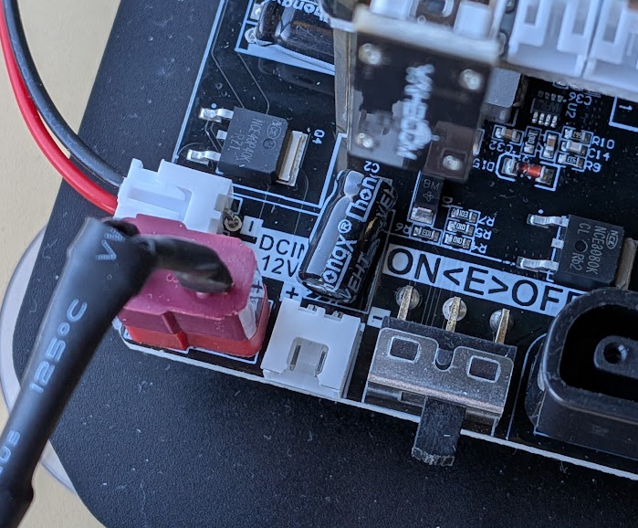
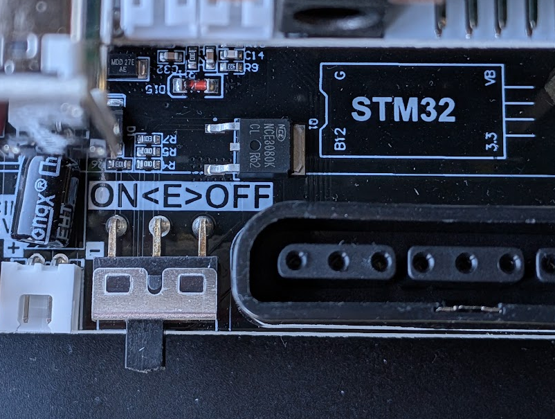
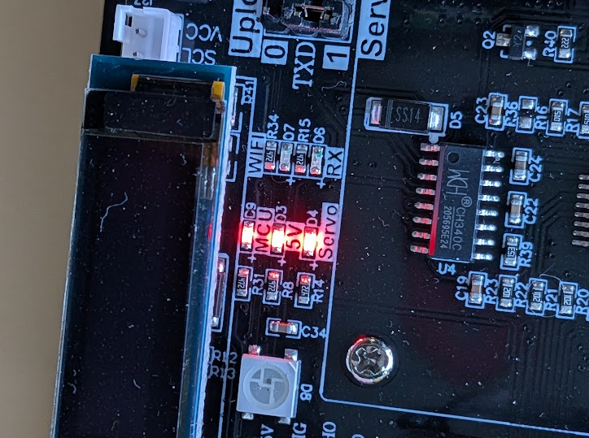
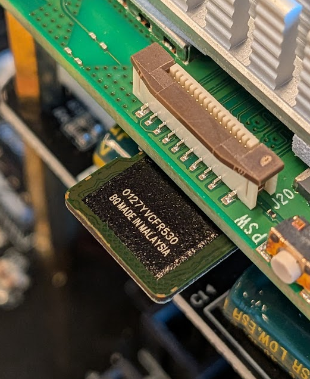
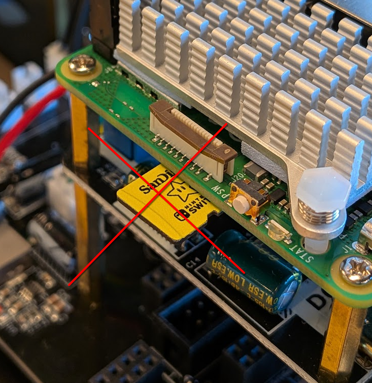
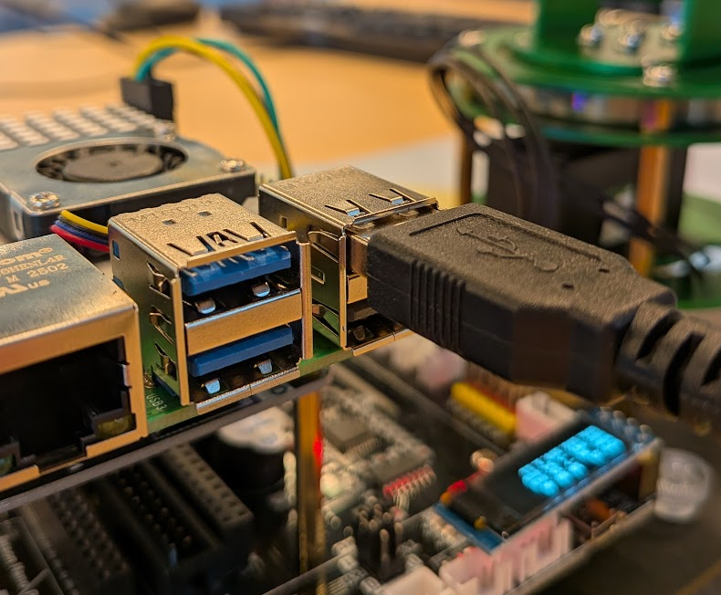
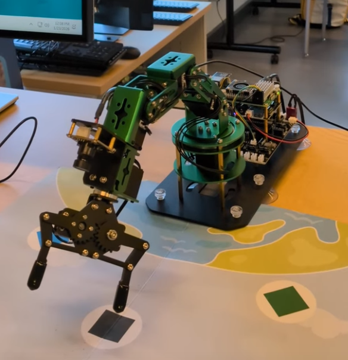

# DOFBOT-Pi Guide

# Table of Contents
+ [Hardware Setup](README.md#hardware-setup)
  + [Power](README.md#power)
  + [Operating system](README.md#operating-system)
  + [Connect peripherals](README.md#connect-peripherals)
+ [Connecting to the device](README.md#connecting-to-the-device)
+ [Controlling the arms](README.md#controlling-the-arms)
+ [OpenCV](README.md#opencv)

## Hardware Setup
To ensure that you don't run in any problems that might interrupt your design and programming, here are a few things to check to make sure your device is set up properly.

### Power
Ensure the red connector is plugged into the bottom black board where it says `DCIN 12V` and that the power adapter (brick) is connected to the wall. 



Make sure the switch is slid all the way to the left. The lights should turn on near OLED screen.



The lights should turn on near OLED screen.



If the OLED screen does not turn on, then the switch on the middle board (the one under the Raspberry Pi) is not switched to `ON`. 

**CAUTION**: If you hear rapid clicking noise immediately switch off the entire station. The rotation of the motors are trying to exceed it's current position leading to possible breakage. Either reset the position of the arms through programming or slowly (and carefully) move them manually, both methods with no power connected.

### Operating system

On Raspberry Pi, make sure the microSD card in inserted correctly (will feel like it's upside down). The image below is the correct way to load it.


 
 The image below is the INCORRECT way to load the microSD card.
 


### Connect peripherals
Plug in a micro-HDMI cable attached to a monitor and connect the keyboard and mouse. Make sure the USB cable for the camera is plugged in to the port shown below.



## Connecting to the device
You can connect to the device through WiFi and the SSH server set up on the Raspberry Pi. Using your laptop, connect to the wireless access pointer called `Dofbot`. The password for the WiFi access is `12345678` (the most secure of passwords :D).

Once you're connected, open up a terminal program on your computer like `Terminal` or PuTTy and use SSH to connect to the Raspberry Pi. The user acccount is called `pi`, the IP address is `192.168.1.11`, and the password is `yahboom`. 

WARNING: If you hear rapid clicking noise: Immediately switch off the entire station. Rotation trying to exceed limits, possible breakage.

## Controlling the arms
There are many ways to control the robot's motors and therefore it's arms. The easiest way to do so while still using your programming skills is through the language Python. Don't worry if you don't know that language! Here's a [simple guide](https://www.programming-idioms.org/cheatsheet/Cpp/Python) to help translate the C++ you know into Python. 

You're going to need the Arm_lib Python library in order to communicate with the robot. You can obtain that [here](https://pypi.org/project/Arm_lib/). These and many other libraries are like the `#include <iostream>` ones you use for your homework. 

You're going to need to use import `Arm_Device` from the `Arm_Lib` along with the time library. Place this at the beginning of your source code:

```py
import time
from Arm_Lib import Arm_Device
```

Next, you're going to have to create an `object` in order to control the motors. Think of the `object` like an instance of a class in C++ except you do it like:

```py
Arm = Arm_Devices()
```

The time library lets you put in delays (or sleep) so that things don't happen all at once. To use the `sleep` ability, you can type:

```py
time.sleep(1)
```

There are many functions of the `Arm_Device` library. The one below allows you to send the degree of rotation for all the motors (instead of calling the function for each, one at a time):

 ```py
Arm.Arm_serial_servo_write6(90, 90, 90, 90, 90, 90, 500)
time.sleep(1)
```

To learn what other functions are available to you, take a look at the `Arm_Lib` library you downloaded or click [here](files/Arm_Lib.py). Part of the fun of hackathons is figuring things out so play around with the various functions.

If all goes well, you can get your robot to do something simple like this (click to download video):

[](videos/robot_moving.mp4) 

## OpenCV
The camera attached to the robot can do some stuff like object detection. Here's a [Wikipedia article](https://en.wikipedia.org/wiki/OpenCV#Applications) explaining a little bit more what OpenCV can do. You'll need the `cv2` Python library to use these features. You also might need the `numpy` library too.

Here's some example code to get you started. Below is a simple program that can detect objects that are red. It will draw a box around the object even when you move it around. 

```py
import time
import cv2
import numpy as np

def camOn():
    # Open the camera
    cam = cv2.VideoCapture(1)

    while True:
        ret, imageFrame = cam.read()

        # Convert to HSV color space (better for color segmentation)
        hsvFrame = cv2.cvtColor(imageFrame, cv2.COLOR_BGR2HSV)
        
        # Define lower and upper bounds for the red hue.
        red_lower = np.array([136, 87, 111],  np.uint8)
        red_upper = np.array([180, 255, 255], np.uint8)
        red_mask = cv2.inRange(hsvFrame, red_lower, red_upper)

        # Morphological Transform, Dilation 
        # for each color and bitwise_and operator 
        # between imageFrame and mask determines 
        # to detect only that particular color 
        kernel = np.ones((5, 5), "uint8") 
        
        # For red color 
        red_mask = cv2.dilate(red_mask, kernel) 
        res_red = cv2.bitwise_and(imageFrame, imageFrame, mask = red_mask)

        # Creating contour to track red color 
        contours, hierarchy = cv2.findContours(red_mask, cv2.RETR_TREE, cv2.CHAIN_APPROX_SIMPLE)

        for pic, contour in enumerate(contours): 
            area = cv2.contourArea(contour) 
            if(area > 1000): 
                x, y, w, h = cv2.boundingRect(contour) 
                imageFrame = cv2.rectangle(imageFrame, (x, y), (x + w, y + h), (0, 0, 255), 2) 
                
                cv2.putText(imageFrame, "Red Colour", (x, y), cv2.FONT_HERSHEY_SIMPLEX, 1.0, (0, 0, 255))

        # Display the captured frame
        cv2.imshow('Does it RED???!?', imageFrame)

        # Press 'q' to exit the loop
        if cv2.waitKey(1) == ord('q'):
            break

    # Release the capture and writer objects
    cam.release()
    out.release()
    cv2.destroyAllWindows()

camOn()
```

If the camera doesn't seem to connect when you run the program, you might need to unplug the USB connect, wait a few seconds, and then plug it back in.

