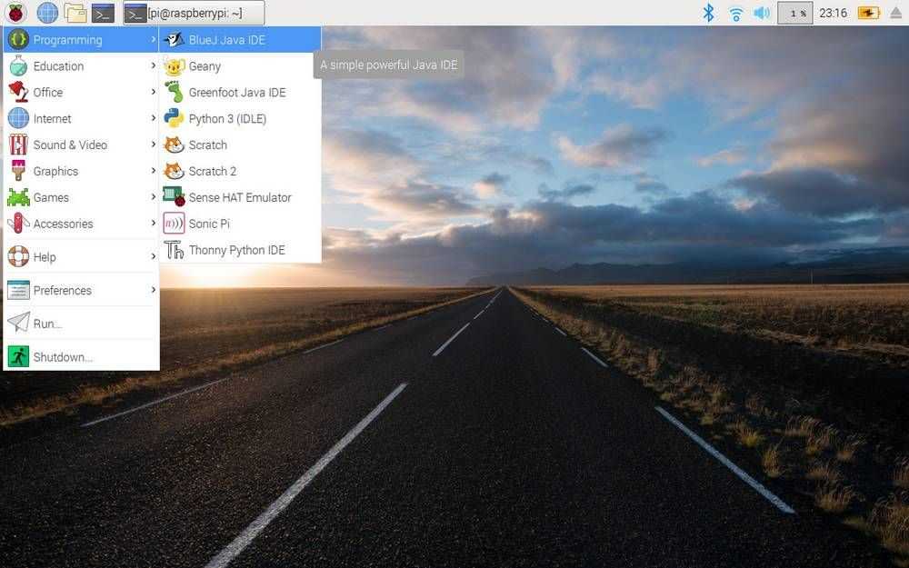

# Foundational Linux Skills

Much of the software you'll be using will be running on Linux so it's important to learn how to it. If you've never used Linux before, that's not a problem! A lot of what you'll encounter will feel familiar if you've used Windows or macOS before. 

There's often this misconception that you need to know how to code in order to use Linux. While it's handy to know in certain situations, it's not required and many things can be accomplish through the graphical user interface ([GUI](https://en.wikipedia.org/wiki/Graphical_user_interface)).

As an added bonus, if you'll looking to transfer to Portland State University and/or taking CS161B, this guide will help you reinforce the information you may have learned in class and prepare you for using Linux at PSU. 

Feel free to skip around the guide if you and your team are already familar with some of the operations below.

# Table of Contents

* Navigating Around
	- GUI
	- Command Line
		+ Looking around
		+ Copying & moving files
		+ Deleting files
* Editing code
	- Using `nano`
	- Using `vim`
* Running code

## Navigating Around

### GUI

Like many of the operating systems you may have used before, many programs can be accessed by clicking on the ... button in the top left corner of the screen, similar to the Start button on many versions of Windows. 

One of these programs is the file manager seen below:

Another program is ...

### Command Line

In some situations, such as running the code that controls your robot, you'll need access to the command line. 

