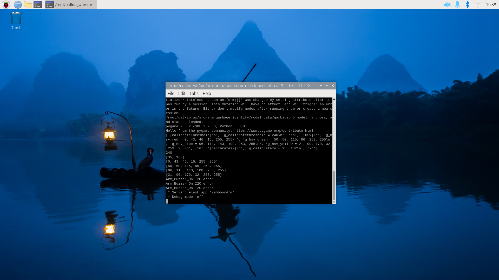
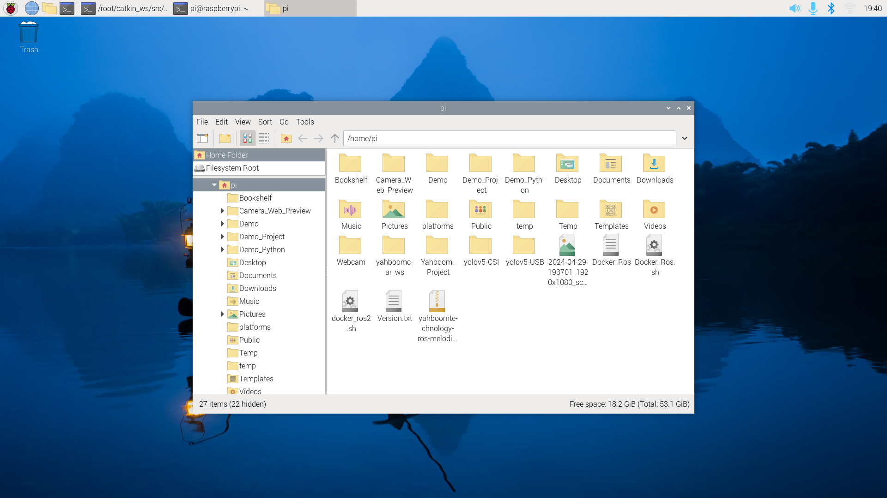
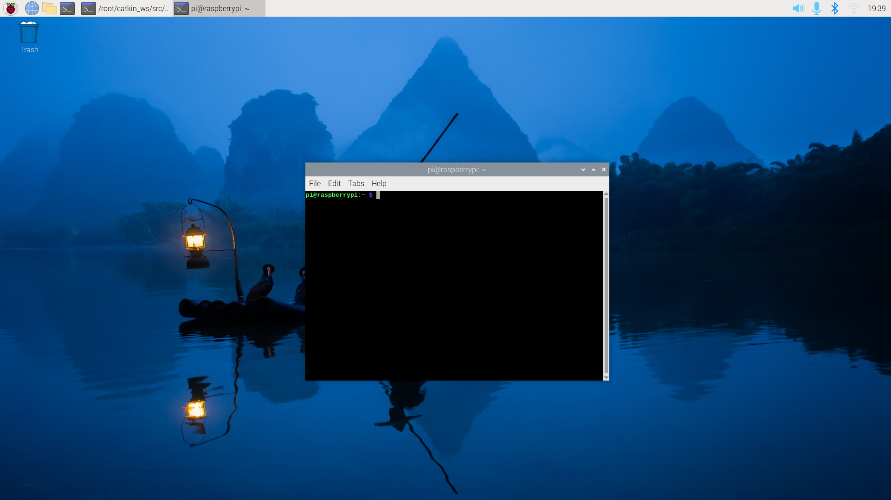

# Foundational Linux Skills

Much of the software you'll be using will be running on Linux so it's important to learn how to use it. If you've never used Linux before, that's not a problem! A lot of what you'll encounter will feel familiar if you've used Windows or macOS before. 

There's often this misconception that you need to know how to code in order to use Linux. While it's handy to know in certain situations, it's not required and many things can be accomplish through the graphical user interface ([GUI](https://en.wikipedia.org/wiki/Graphical_user_interface)).

As an added bonus, if you'll looking to transfer to Portland State University and/or taking CS161B onward at PCC, this guide will help you reinforce the information you may have learned in class and prepare you for using Linux at PSU. 

Feel free to skip around the guide if you and your team are already familar with some of the operations below.

# Table of Contents

* [Navigating Around](README.md#navigating-around)
	- [GUI](README.md#gui)
	- [Command Line](README.md#command-line)
		+ [Looking around](README.md#looking-around)
		+ [Copying & moving files](README.md#copying--moving-files)
		+ [Deleting files](README.md#deleting-files)
		+ [Wildcards](README.md#wildcards)
		+ [Other commands](README.md#other-commands)
		+ [Superuser access](README.md#superuser-access)
		+ [Rebooting](README.md#rebooting)
* Editing code
	- Using `nano`
	- Using `vi`
* Running code

## Navigating Around

### GUI

Like many of the operating systems you may have used before, many programs can be accessed by clicking on the Raspberry Pi button in the top left corner of the screen, similar to the Start button on many versions of Windows. 

One of these programs is the file manager seen below:

The file manager program for Linux is very similar to the File Manager in Windows or the Finder in macOS. You can organize your files using this program. It can be launched by clicking on the overlapping files folder icon located in the top left corner of the screen (2 spots to the right of the Raspberry Pi logo). 

Create folders, copy files, move folders, etc... like you normally would. Staying organized if you have more than a few team members can help make the process of creating something much more pleasant. Especially if you're working on a lot of files together. 

### Command Line

In some situations, such as running the code that controls your robot, you'll need access to the command line. It's best to think of the command line as typing out what you want the computer to do as opposed to clicking and/or dragging things like you would normally do. 

For example, if you wanted to move one folder (also called a directory) to another one, you might click and drag it into its destination. Using the command line, you could accomplish the same thing by typing:

> mv folder_you_want_to_move folder_you_want_to_move_it_to

So what are the benefits of using using the command line versus using the GUI? In come cases, it's much faster. While the previous example may look like there's a lot to type, it can be sped up by using the `TAB` key on your keyboard. 

Like naming variables in your programming assignments, the stuff on the command line is case-sensative (capital letters are not the same as lowercase ones). Using our previous example of moving a folder, the `mv` command is different than `mV` and `MV`. So if something isn't running correctly, check to make sure the letter case is correct.

Below you'll find some very useful and common commands you can use:

#### Looking around
**ls** - this command lists the contents of a folder/directory. Helpful options include:
+ `-l` - (that's the letter `L`) this option allows you to display the contents of a directory in list form where each line is a file and it's informtion. By default it lists just the names of stuff in columns.
+ `-a` - this option lists ALL files and directories including hidden ones which begin with a "`.`" (period).

#### Copying & moving files
**cp** - this command copies files and directories to a certain location. It uses the form:  

> $ cp *source* *destination*
  
where the "`source`" is a file, directory, etc... and "`destination`" is where you want to copy it to. For example:

> $ cp myfile a_folder/a_folder_in_a_folder/

copies the file `myfile` into the directory/folder called `a_folder_in_a_folder/` that located in another folder called `a_folder`. 

You can also makes copies of a file. For example, if you wanted to make a back-up of a file, you would type:

> $ cp myfile myfile.bak

That would take the file `myfile`, make a copy, and rename it `myfile.bak`.

**mv** - you've seen this command up above. It moves files and folders from one location to another. It also follows the "`source`" to "`destination`". 

#### Deleting files
**rm** - this command removes a file. **BE CAREFUL** with this command. Unlike deleting files in Windows or macOS, it deletes it permanantly without asking if you're sure! There are some handy options to use with this command:
+ `-i` - this option asks you if you want to delete a file. Some people often automatically type this option when they delete just in case. There are files you can modify so that it will automatically ask you if you want to delete a file but that's beyond the scope of this guide.
+ `rf` - this option can be a **VERY DANGEROUS** option. It will delete all files and subfolder's in a folder without asking you. For this reason, always have backups of files you don't want to start from scratch on!

> $ rm -i file_I_want_to_remove.txt

**rmdir** - this command removes a folder/directory BUT the directory needs to be completely empty. That includes hidden files.

> $ rmdir empty_folder_to_remove

#### Wildcards
Sometimes you want to delete files that have a commonality in their name. You can use the "`*`" character to make that happen. For example, let's say you wanted to delete all files that end in "`.txt`". You would type:

> $ rm *.txt

Or if you wanted to say to copy all files from the current folder to another you would type:

> $ cp ./* a_folder/a_folder_in_a_folder/

#### Other commands
**man** - this command is used to bring up the manual for a particular command. It tells you about the program, what options are available for it, and so much more! To use it type

> $ man *command*

For example:

> $ man cp

will bring up the manual for the `cp` command and all available options.

#### Superuser access
**sudo** - this command allows you to run other commands as a "superuser". This special type of user has full control off the system. Sometimes certain files you might need are locked behind certain permissions and you can only interact with them using `sudo`. For example let's say you need to copy a configuration file from a place you don't have access to one you do:

> $ sudo cp restricted_folder/restricted_file.txt no_restriction_folder

USE CAUTION was using `sudo`. Because of the power of the command, it can mess things up alot and you won't be able to recover your work. 

#### Rebooting
**reboot** - this command allows you to reboot the Raspberry Pi or other single-board computer like the Jetson Nano. You might need to use this if the robot isn't responding to instructions anymore or if you updated some system feature. Make sure all your work is saved before rebooting.
